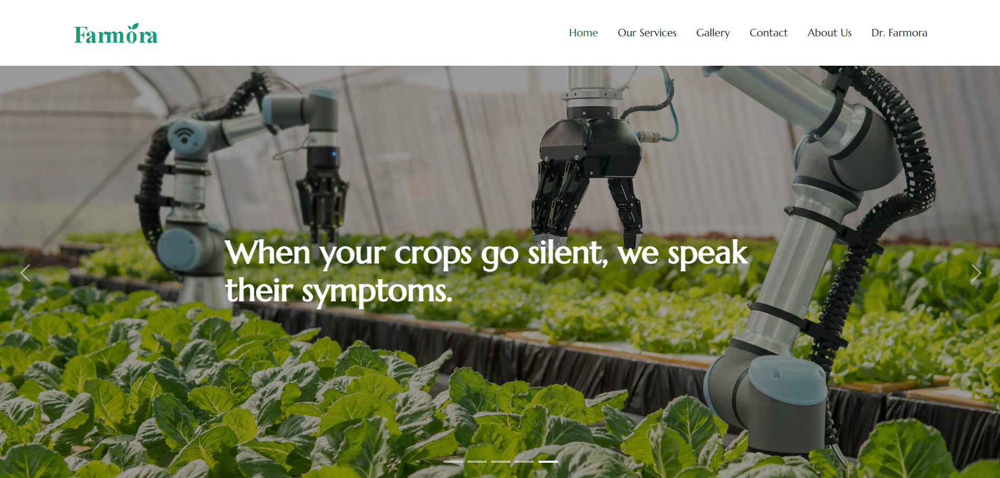
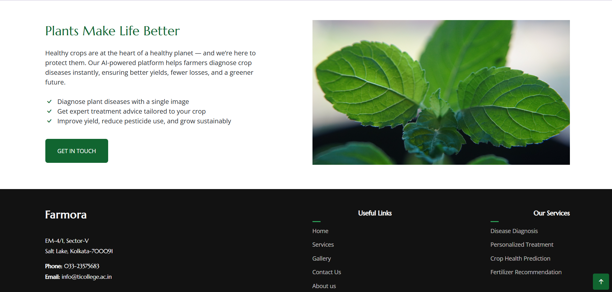
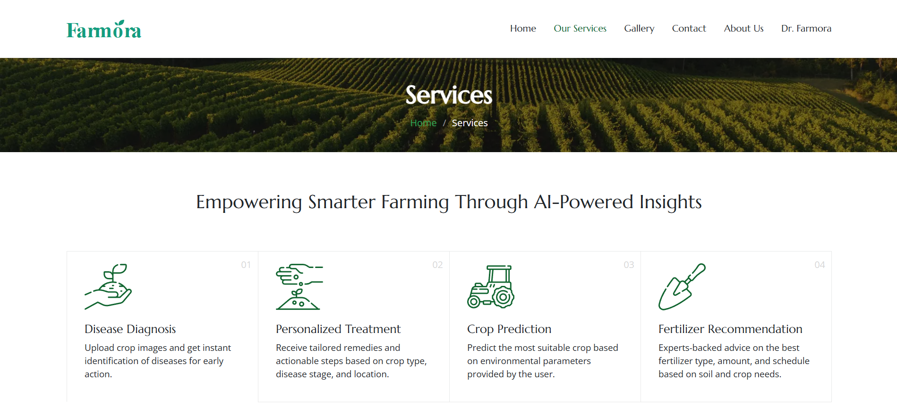
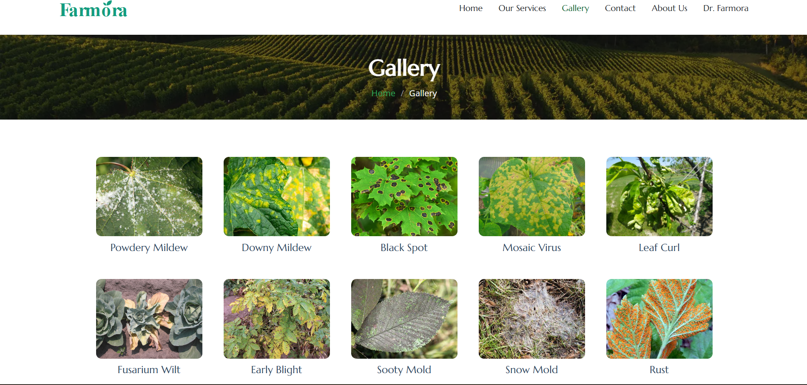
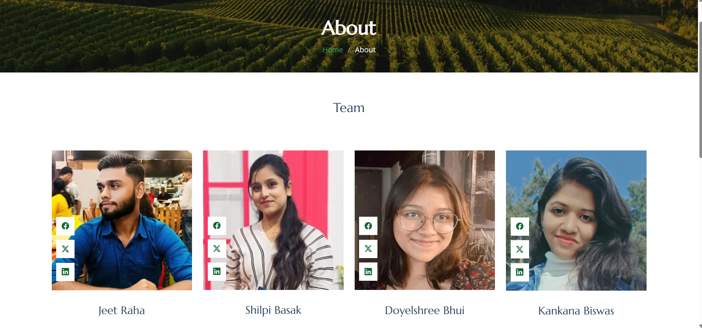
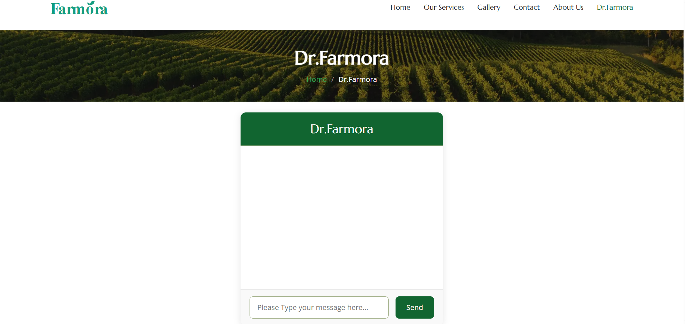

# 🌱 Farmora — AI-Powered Smart Farming Platform

Farmora is an AI-driven agricultural assistant designed to help farmers and agronomists diagnose plant diseases, predict crop suitability, and receive personalized treatment and fertilizer recommendations.  
The platform combines **Computer Vision, Machine Learning, and NLP** to enable smarter, sustainable farming decisions.

---

## 🚀 Features

✅ **Plant Disease Diagnosis**  
Upload a crop image and instantly detect plant diseases using CNN-based image classification.

✅ **Personalized Treatment Suggestions**  
Get tailored treatment recommendations based on crop type, disease stage, and environmental conditions.

✅ **Crop Prediction**  
Analyze environmental parameters such as rainfall and soil pH to recommend suitable crops.

✅ **Fertilizer Recommendation**  
Receive expert-backed fertilizer advice including type, quantity, and usage schedule.

✅ **AI Chat Assistant (Dr. Farmora)**  
An interactive chatbot to answer farming-related queries in real time.

---

## 🧠 Technologies Used

- **Frontend:** HTML, CSS, JavaScript  
- **Backend / Logic:** Python  
- **Machine Learning:** CNN, ML Models  
- **AI Domains:** Computer Vision, NLP  
- **Tools & Libraries:** TensorFlow / Keras, OpenCV, NumPy  

---

## 📊 Model Performance

- **Plant Disease Detection Accuracy:** ~92%  
- Trained on labeled crop disease image datasets  
- CNN models used for feature extraction and classification  

---

## 🖼️ Project Screenshots

### 🔹 Home Page

---

### 🔹 Services Page

---

### 🔹 Disease Diagnosis & Crop Services

---

### 🔹 Gallery (Disease Dataset Preview)

---

### 🔹 About Us & Team

---

### 🔹 Dr. Farmora (AI Assistant)

---

## 👥 Team Members

- **Jeet Raha**  
- **Shilpi Basak**  
- **Doyelshree Bhui**  
- **Kankana Biswas**

---

## 📍 Project Status

✅ **Completed**

---

## 🌍 Impact

- Early disease detection reduces crop loss  
- Promotes sustainable and organic farming practices  
- Helps farmers make data-driven decisions  
- Reduces excessive pesticide usage  

---

## 📌 Future Enhancements

- Mobile application support  
- Multi-language chatbot support  
- IoT sensor integration  
- Real-time weather API integration  

---

## 📜 License

This project is developed for academic and educational purposes.
